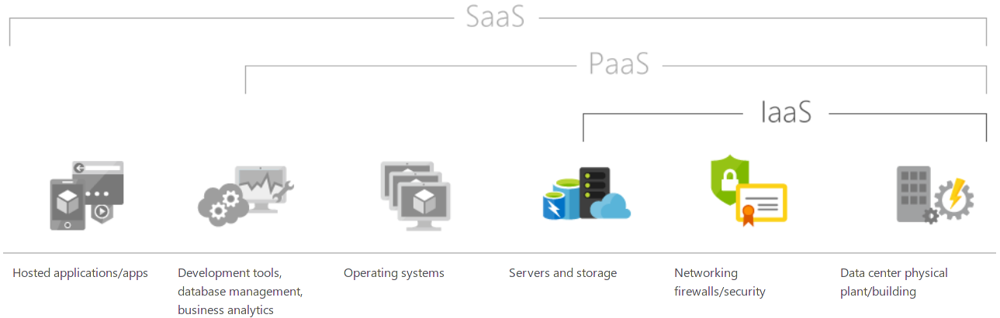
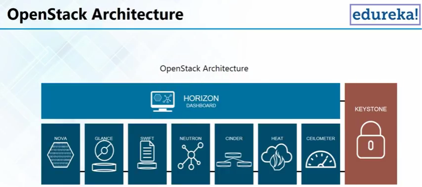
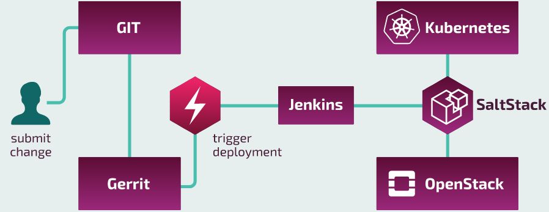

# Cloud computing
Type of internet based computing that provides shared computer processing resources and data.

- "bare metal" server with a virtualization layer on top of it
- IaaS: infrastructure as a service (e.g. OpenStack)
- PaaS: platform as a service
- SaaS: software as a service

(source: [What is IaaS?](https://azure.microsoft.com/en-us/overview/what-is-iaas/))

## Table of contents
* [OpenStack](#openstack)
* [VM](#vm)
* [Cgroups and namespaces](#cgroups-ang-namespaces)
* [LXC](#lxc)
* [Docker](#docker)
* [Kubernetes](#kubernetes)
* [SaltStack](#saltstack)
* [See also](#see-also)

## OpenStack
- gives components to set up cloud infrastructure, provides set of tools and services
- backed up by big IT companies

(source: [What Is OpenStack | OpenStack Tutorial For Beginners | OpenStack Training | Edureka])

- Keystone: authentication service (users and privilages)
- Glance: launches instances from the images (e.g. Gentoo, Debian, CentOS)
- Nova: computing domain
- Neutron: networking service, responsible for communication between services
- Swift: object storage component
- Cinder: block storage component
- Horizon: dashboard
- Ceilometer: part of telemetric project
- Heat: part of orchestration program.
>The mission of the OpenStack Orchestration program is to create a human- and machine-accessible service for managing the entire lifecycle of infrastructure and applications within OpenStack clouds.

## VM
(source: [Virtual Machine])
>Virtual machine (VM) is an emulation of a computer system. Virtual machines are based on computer architectures and provide functionality of a physical computer. Their implementations may involve specialized hardware, software, or a combination.

>Some virtual machines, such as QEMU, are designed to also emulate different architectures and allow execution of software applications and operating systems written for another CPU or architecture.

>Operating-system-level virtualization allows the resources of a computer to be partitioned via the kernel's support for multiple isolated user space instances

[img source](https://www.veeam.com/blog/why-virtual-machine-backups-different.html)

__VM emulates hardware and kernel__ (see picture on the right) - this can have a __negative impact on a performance__.

## Cgroups and namespaces
(source: [difference between cgroups and namespaces])

>- Cgroups = limits __how much__ you can use

>- namespaces = limits __what you can see__ (and therefore use)

>- cgroup: Control Groups provide a mechanism for aggregating/partitioning sets of tasks, and all their future children, into hierarchical groups with specialized behaviour.

>- namespace: wraps a global system resource in an abstraction that makes it appear to the processes within the namespace that __they have their own isolated instance of the global resource__.

## LXC

(source: [LXC])

>LXC (Linux Containers) is an operating-system-level virtualization method for running multiple isolated Linux systems (containers) on a control host __using a single Linux kernel__.

>The Linux kernel provides the cgroups __functionality that allows limitation and prioritization of resources__ (CPU, memory, block I/O, network, etc.) __without the need for starting any virtual machines__

>LXC combines the kernel's cgroups and support for isolated namespaces to __provide an isolated environment for applications__.

## Docker

- creates the containers with the defined versions of software (e.g. Apache HTTP server)
- unifies environments (build, test) across machines

## Kubernetes

A platform for working with containers:
- deployment
- scaling
- monitoring

#### Problem
Instead of 3 servers you have 40 servers. How do you decide what containers go where

#### Solution
Use kubernetes to do it for you.

## SaltStack
SaltStack automates repeated system administrative and code deployment tasks, eliminating manual processes in a way that can reduce errors that occur when IT organizations configure systems.

Meanwhile check out:
- https://vimeo.com/289137260
- https://searchitoperations.techtarget.com/definition/SaltStack

## See also
- [What Is OpenStack | OpenStack Tutorial For Beginners | OpenStack Training | Edureka] (YouTube)
- [Containers: cgroups, Linux kernel namespaces, ufs, Docker, and intro to Kubernetes pods] (YouTube)
- [Virtual Machine] (Wikipedia)
- [difference between cgroups and namespaces] (StackOverflow)
- [LXC] (Wikipedia)
- [What is Docker?] (YouTube)
- [What is Kubernetes] (YouTube)
- [Understanding the Difference Between Virtualization and Containers] (YouTube)

[What Is OpenStack | OpenStack Tutorial For Beginners | OpenStack Training | Edureka]: https://www.youtube.com/watch?v=Kfj5XiNdJN0
[difference between cgroups and namespaces]: https://stackoverflow.com/a/34825184
[Virtual Machine]: https://en.wikipedia.org/wiki/Virtual_machine
[Containers: cgroups, Linux kernel namespaces, ufs, Docker, and intro to Kubernetes pods]: https://www.youtube.com/watch?v=el7768BNUPw
[LXC]: https://en.wikipedia.org/wiki/LXC
[What is Docker?]: https://www.youtube.com/watch?v=RyxXe5mbzlU
[What is Kubernetes]: https://www.youtube.com/watch?v=R-3dfURb2hA
[Understanding the Difference Between Virtualization and Containers]: https://www.youtube.com/watch?v=rfjmeakbeH8
