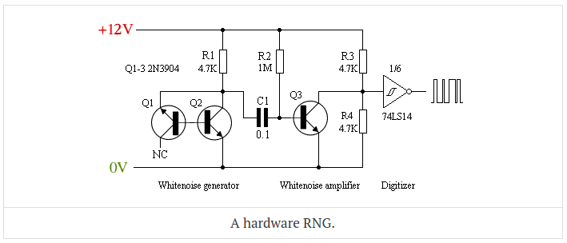
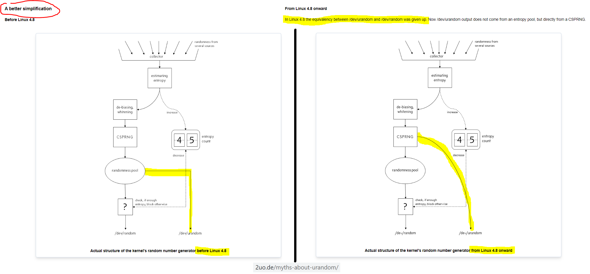
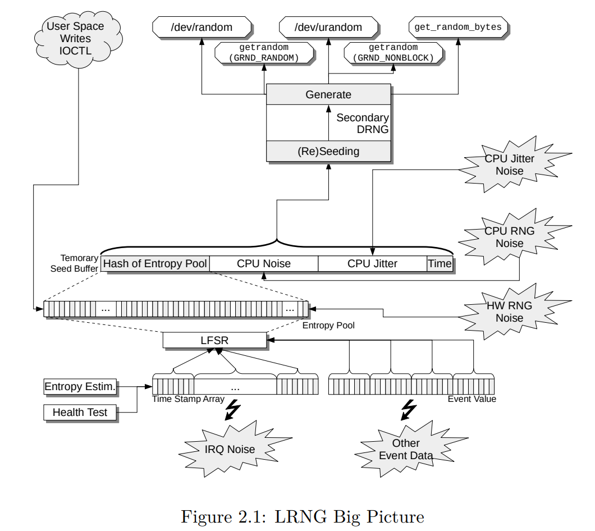

# Cryptography cheatsheat


## DISCLAIMER
This subject is very complex. I put here references that I find reliable. If
you disagree with some of this statements let me know (e.g. by creating an
issue)


## Table of contents
* [Table of contents](#table-of-contents)
* [Random Number Generators](#random-number-generators)
* [VMs and embedded devices](#vms-and-embedded-devices)
* [How much entropy do I need](#how-much-entropy-do-i-need)
* [/dev/random vs /dev/urandom](#/dev/random-vs-/dev/urandom)
* [Password Hashing](#password-hashing)
* [Practical approaches for increasing amount of entropy](#practical-approaches-for-increasing-amount-of-entropy)
* [RNG differences between Linux versions](#rng-differences-between-linux-versions)
* [See also](#see-also)


## Random Number Generators
> entropy - essentially a measure of unpredictability 

(source: https://blog.cryptographyengineering.com/2012/02/21/random-number-generation-illustrated/)

### Sources of entropy:
- [white noise](https://en.wikipedia.org/wiki/White_noise)
- [shot noise](https://en.wikipedia.org/wiki/Shot_noise)
- [radioactive decay](https://en.wikipedia.org/wiki/Radioactive_decay)
- drive seek timings
- mouse and keyboard interaction
- network events
- uninitialized memory
- goofy stuff ("some systems will try to collect entropy by conducting unpredictable calculations")
- [Trusted Platform Module](https://en.wikipedia.org/wiki/Trusted_Platform_Module)
- new processors RNGs

(source: https://blog.cryptographyengineering.com/2012/02/21/random-number-generation-illustrated/)



(source: https://blog.cryptographyengineering.com/2012/02/21/random-number-generation-illustrated/)


(source: https://xkcd.com/221/)

> On most Unix systems you can get decent random numbers by reading from /dev/random and /dev/urandom devices

(source: https://blog.cryptographyengineering.com/2012/02/21/random-number-generation-illustrated/)

### Pseudo Random Generators

> The big problem with RNGs is that they’re usually pretty inefficient.
> (...)
> PRGs don’t generate random numbers at all. Rather, they’re algorithms that take in a short random string (‘seed’), and stretch it into a long sequence of random-looking bits.

(source: https://blog.cryptographyengineering.com/2012/02/21/random-number-generation-illustrated/)


## VMs and embedded devices
> (...) your VM may be a clone. Perhaps you just burped up fifty instances of that particular image from a ‘frozen’ state. Each of these VMs may have loads of entropy in its pool, but it’s all the same entropy, across every clone sibling.

> Embedded devices present their own class of problems. Unfortunately (like every other problem in the embedded arena) there’s no general solution.

(source: https://blog.cryptographyengineering.com/2012/02/21/random-number-generation-illustrated/)


## How much entropy do I need
> The general recommendation is that you need to seed your PRG with at least as much entropy as the security level of your algorithms
> (...)
> In practice you need more, possibly as much as twice the security level, depending on your PRG.

(source: https://blog.cryptographyengineering.com/2012/02/21/random-number-generation-illustrated/)


## /dev/random vs /dev/urandom
> The /dev/random interface is considered a legacy interface, and /dev/urandom is preferred and sufficient in all use cases, with the exception of applications which require randomness during early boot time

(source: http://man7.org/linux/man-pages/man4/random.4.html)

> Use urandom. Use urandom. Use urandom. Use urandom. Use urandom. Use urandom.

(source: https://sockpuppet.org/blog/2014/02/25/safely-generate-random-numbers/)

### Why not {SecureRandom, OpenSSL, havaged, &c}?
- the kernel has access to raw device entropy
- it can promise not to share the same state between applications
- a good kernel CSPRNG, like FreeBSD’s, can also promise not to feed you random data before it's seeded

(source: https://sockpuppet.org/blog/2014/02/25/safely-generate-random-numbers/)

### Entropy at boot
> When read during early boot time, /dev/urandom may return data prior to the entropy pool being initialized. If this is of concern in your application, use getrandom(2) or /dev/random instead.

(source: http://man7.org/linux/man-pages/man4/random.4.html)

> On Linux, if your software runs immediately at boot, and/or the OS has just been installed, your code might be in a race with the RNG. That’s bad, because if you win the race, there could be a window of time where you get predictable outputs from urandom. This is a bug in Linux, and you need to know about it if you’re building platform-level code for a Linux embedded device.
>
> This is indeed a problem with urandom (and not /dev/random) on Linux. It’s also [a bug in the Linux kernel](https://factorable.net/weakkeys12.extended.pdf). But it’s also easily fixed in userland: at boot, seed urandom explicitly. Most Linux distributions have done this for a long time. But don’t switch to a different CSPRNG

(source: https://sockpuppet.org/blog/2014/02/25/safely-generate-random-numbers/)


## Password Hashing
- [Argon2](https://en.wikipedia.org/wiki/Argon2) is currently recommended (see [Password Hashing Competition](https://password-hashing.net/))
- [Salt](https://en.wikipedia.org/wiki/Salt_%28cryptography%29)
- [How Dropbox securely stores your passwords (2016)](https://blogs.dropbox.com/tech/2016/09/how-dropbox-securely-stores-your-passwords/)


## Practical approaches for increasing amount of entropy in Linux
> The Linux kernel uses various sources such as user input to generate entropy, which is in turn used for generating random numbers. Encrypted communications can use a lot of entropy, and often the amount of entropy generated by your system will not be sufficient. This is commonly an issue on headless server systems, which can also include ARM systems such as Raspberry Pi, and can result in slower than normal ssh connections among other issues.

(source: https://www.funtoo.org/index.php?title=Install/Finishing)

### Checking for available entropy
1. Get available entropy (in bits) and size of the entropy pool. **Disclaimer**
   this can be much lower after the boot than later when the system is running
```
echo $(cat /proc/sys/kernel/random/entropy_avail)/$(cat /proc/sys/kernel/random/poolsize)
```
2. If available entropy is [below 1000](https://developers.redhat.com/blog/2017/10/05/entropy-rhel-based-cloud-instances/) you can think about improving it
3. Check how your machine deals with [FIPS 140-2](https://en.wikipedia.org/wiki/FIPS_140-2) standard. Make sure that [rng-tools](https://github.com/nhorman/rng-tools) are installed on your system
```
rngtest -c 1000 < /dev/random
```

### Compensate for low entropy
To compensate for low entropy it is possible to use a hardware random number generator (e.g. [TPM](https://en.wikipedia.org/wiki/Trusted_Platform_Module)),
a [secure pseudorandom number generator](https://www.schneier.com/academic/fortuna/) or enable a user-space entropy generator at boot time
To identify the different sources of entropy available in the system, use
```
rngd --list
```
For more info refer to [Random number generation (Arch Linux Wiki)]


## RNG differences between Linux versions
1. According to https://www.2uo.de/myths-about-urandom/ there are differences
between kernels before 4.8 and 4.8 onwards



(source: https://www.2uo.de/myths-about-urandom/)

2. There is also [LRNG project](https://www.chronox.de/lrng.html) (looks like
   included in kernel since version `4.15` but I could not find any info is it used by
   default, [LWN mentions](https://lwn.net/Articles/704355/) that from
   version `4.9-rc1`)



(source: https://www.chronox.de/lrng/doc/lrng.pdf)


## See also
- [Random number generation: An illustrated primer (2012)](https://blog.cryptographyengineering.com/2012/02/21/random-number-generation-illustrated/)
- [random, urandom - kernel random number source devices (2017)](http://man7.org/linux/man-pages/man4/random.4.html)
- [Random number generation (Arch Linux Wiki)](https://wiki.archlinux.org/index.php/Random_number_generation)
- [A Broken Random Number Generator in AMD Microcode (2019)](https://www.schneier.com/blog/archives/2019/10/a_broken_random.html)
- [How To Safely Generate A Random Number (2014)](https://sockpuppet.org/blog/2014/02/25/safely-generate-random-numbers/)
- [Dan Boneh's Publications](https://crypto.stanford.edu/~dabo/pubs/pubs.html)
- [Linux Random Number Generator - A New Approach (2020)](http://www.chronox.de/lrng/doc/lrng.pdf)
- [Lessons from the Debian/OpenSSL Fiasco (2008)](https://research.swtch.com/openssl)
- [Google confirms critical Android crypto flaw used in $5,700 Bitcoin heist (2013)](https://arstechnica.com/information-technology/2013/08/google-confirms-critical-android-crypto-flaw-used-in-5700-bitcoin-heist/)
- [Mining Your Ps and Qs: Detection of Widespread Weak Keys in Network Devices (2012)](https://factorable.net/weakkeys12.extended.pdf)
