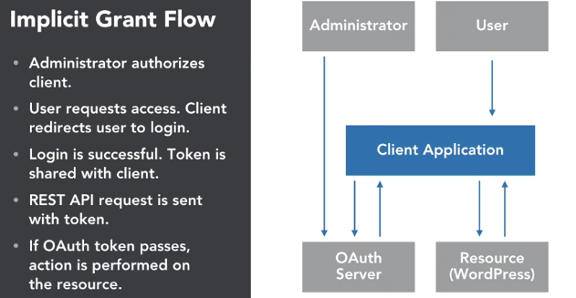

# OAuth
- API access without an username and password
- Users and services can control clients
- OAuth 2 authentication requires HTTPS

## OAuth 2 standard authorization flow
Client → (login) → Authorization Server → (tokens) → Client → API Server

(source: https://www.linkedin.com/learning/wordpress-rest-api-authentication/what-is-oauth-2-authentication)

## Token types
- Access token - the secret and often short-lived-token that identifies a user
- Refresh token - longer-lived token used to renew access token when it expires
- Scopes provide for right associated with the access token

### Grants
- Several grant types that impact flows
- Authorization code grant is most common
- Implicit is common in web apps and mobile apps
- Client credentials grant is useful in system-to-system comms

## Grant types
- [Authorization Code](https://oauth.net/2/grant-types/authorization-code/)
- [Implicit](https://oauth.net/2/grant-types/implicit/)
- [Password](https://oauth.net/2/grant-types/password/)
- [Client Credentials](https://oauth.net/2/grant-types/client-credentials/)
- [Device Code](https://oauth.net/2/grant-types/device-code/)
- [Refresh Token](https://oauth.net/2/grant-types/refresh-token/)

## Scope
- Define the access a service can use
- Google example: scope says that some application can read contacts and emails but it CAN NOT read google docs

## See also
- [OAuth 2 simplified](https://aaronparecki.com/oauth-2-simplified/)
- [Grant types](https://oauth.net/2/grant-types/)
- [JSO](https://github.com/andreassolberg/jso)
