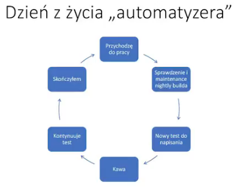
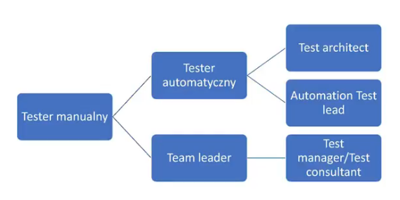

# Automation QA engineer - kompendium wiedzy

## Spis rzeczy
* [Poziomy testowania](#poziomy-testowania)
* [Kiedy stosować testy automatyczne](#kiedy-stosować-testy-automatyczne)
* [Kiedy NIE stosować testów automatycznych](#kiedy-nie-stosować-testów-automatycznych)
* [Proces automatyzacji](#proces-automatyzacji)
* [Dobór narzędzia do testowania](#dobór-narzędzia-do-testowania)
* [Frameworki w automatyzacji](#frameworki-w-automatyzacji)
* [Granica między narzędziem a frameworkiem do automatyzacji testów](#granica-między-narzędziem-a-frameworkiem-do-automatyzacji-testów)
* [Dobre praktyki testów automatycznych](#dobre-praktyki-testów-automatycznych)
* [Dzień z życia "automatyzera"](#dzień-z-życia-automatyzera)
* [Etapy idealnego testowania](#etapy-idealnego-testowania)
* [Możliwe ścieżki kariery](#możliwe-ścieżki-kariery)
* [Rady od Patryka Hemperka](#rady-od-patryka-hemperka)
* [Zobacz też](#zobacz-też)

## Poziomy testowania
(źródła: [wikipedia-PL], [wikipedia-EN])

#### Testy jednostkowe (en. *unit testing*)
>Unit testing refers to tests that verify the functionality of a specific section of code
>Unit testing alone cannot verify the functionality of a piece of software, but rather is used to ensure that the building blocks of the software work independently from each other.
>Unit testing might include static code analysis, data-flow analysis, metrics analysis, peer code reviews, code coverage analysis and other software testing practices.

#### Testy integracyjne (en. *integration testing*)
>Phase in software testing in which individual software modules are combined and tested as a group. 
>Integration testing works to expose defects in the interfaces and interaction between integrated components (modules). Progressively larger groups of tested software components corresponding to elements of the architectural design are integrated and tested until the software works as a system.

#### Testy systemowe (en. *system testing*)
>System testing tests a completely integrated system to verify that the system meets its requirements.
>For example, a system test might involve testing a logon interface, then creating and editing an entry, plus sending or printing results, followed by summary processing or deletion (or archiving) of entries, then logoff.

#### Testy akceptacyjne (en. *operational acceptance testing*)
>Operational acceptance is used to conduct operational readiness (pre-release) of a product, service or system as part of a quality management system.
>In addition, the software testing should ensure that the portability of the system, as well as working as expected, does not also damage or partially corrupt its operating environment or cause other processes within that environment to become inoperative.

## Kiedy stosować testy automatyczne
(źródło: [Co to jest zautomatyzowane testowanie?])

- testy, które są często powtarzane
- testy, które są nudne lub trudne do wykonania ręcznie
- testy, które są czasochłonne
- testy wysokiego ryzyka

## Kiedy NIE stosować testów automatycznych
(źródło: [Co to jest zautomatyzowane testowanie?])

- testy świeżo zaprojektowane, które nie zostały jeszcze przeprowadzone ręcznie
- testy, dla których wymagania zmieniają się czesto
- testy *ad-hoc* (doraźne)

## Proces automatyzacji
(źródło: [Co to jest zautomatyzowane testowanie?])

#### Wybór narzędzia do testowania
Zależny od technologi, w której testowana aplikacja jest stworzona

#### Określenie zakresu automatyzacji
Jest to zakres tesowanej aplikacji, który zostanie zautomatyzowany

#### Planowanie, projektowanie i rozwój
Proces tworzenia strategii i planu automatyzacji

#### Wykonanie testu
Skrypty automatyzacyjne są wykonywane podczas tej fazy

#### Utrzymanie
Wraz z dodawaniem nowych funkcjonalności do testowanego systemu, skrypty automatyzacyjne muszą być dodane, przejrzane i skorygowane dla każdego cykl
u publikacji.
Utrzymanie staje się konieczne, aby poprawić efektywność skryptów automatyzacyjnych.

## Dobór narzędzia do testowania
(źródło: [Co to jest zautomatyzowane testowanie?])

- łatwość w użyciu (pod względem języka skryptowego)
- obsługa różnych rodzajów testów
- wsparcie dla wielu frameworków testowych

## Frameworki w automatyzacji
(źródło: [Co to jest zautomatyzowane testowanie?])

Framework - zbiór wytycznych automatyzacji, które pomagają w:
- utrzymaniu spójności testów
- zmniejszeniu korekt kodu
- poprawia możliwość ponownego użycia

#### Typy frameworków używanych w testach automatycznych

- *Data Driven Automation Framework*
- *Keyword Driven Automation Framework*
- *Modular Automation Framework*
- *Hybrid Automation Framework*

## Granica między narzędziem a frameworkiem do automatyzacji testów
(źródło: [wikipedia-EN](https://en.wikipedia.org/wiki/Test_automation))

- narzędzia są zaprojektowane na konkretne środowisko (np. system operacyjny)
- framework nie jest narzędziem, dzięki któremu można wykonywać konkretne zadanie. Jest to infrastruktura, która dostarcza rozwiązań gdzie różne narzędzia mogą funkcjonować w sposób ujednolicony

## Dobre praktyki testów automatycznych
(źródło: [Co to jest zautomatyzowane testowanie?])

- zakres automatyzacji musi być szczegółowo określony przed rozpoczęciem projektu
- wybór odpowiednego narzędzia do automatyzacji
- wybór odpowiedniego frameworku
- przestrzeganie standardów programowania
- mierz efekty (procent znalezionych błędów, poprawa produktywności)
- graj zespołowo

## Dzień z życia "automatyzera"
(źródło: [Przychodzi tester na rozmowę...])

## Etapy idealnego testowania
(źródło: [Testowanie oprogramowania w świecie idealnym])

1. Czytanie dokumentacji
2. Przygotowanie przypadków testowych (test cases) - ścieżki, którymi może poruszać się użytkownik
3. Przygotowanie środowiska do testów (configuration management)
4. Świadomy rozdział na testy automatyczne i manualne (jednostkowe, funkcjonalne)
5. Oszacowanie czasu potrzebnego na testy
    - przygotowanie przypadków testowych
    - przygotowanie środowiska testowego
    - testowanie funkcjonalności, z uwzględnieniem retestów
    - przygotowanie testów automatycznych
    - ilość dostępnych testerów
    - testy regresyjne
6. "nie działa"
    - kroki, które pozwalają na odtworzenie błędu
    - dane testowe, które zostały wykorzystane (warunki wstępne)
    - informacje o widocznym i oczekiwanym rezultacie
    - informacje na temat środowiska, gdzie dany bug występuje (przeglądarka, system, urządzenie itp.)
    - screeny, jeśli to możliwe

## Możliwe ścieżki kariery
#### (źródło: [Przychodzi tester na rozmowę...])

#### (źródło: [Od testera do... czyli możliwe ścieżki kariery])
>1. Analityk testów – jest to osoba w zespole odpowiedzialna za projektowanie testów, scenariuszy testowych oraz planów testów. Często podczas procesu projektowania ma kontakt z klientem. To analityk wyznacza główne kierunki, w których dana funkcjonalność powinna zostać przetestowana. Krótko mówiąc, taka osoba przekłada wymagania klienta na testowane scenariusze.
>2. Tester automatyczny – obecnie bardzo popularna rola, polegająca na połączeniu umiejętności testera i programisty. Do głównych zadań takiej osoby należy testowanie aplikacji przy użyciu programu, który wykonuje te same czynności, jakie wcześniej realizowano w sposób manualny. Najprostszym przykładem może być logowanie się do sklepu internetowego. Zamiast wykonywać to ręcznie możemy napisać program lub skrypt, który zrobi to za nas i zaraportuje wynik. Ważne jest, aby pamiętać, że nie każdy test można zaprojektować w formie automatu.
>3. Manager Testów – to stanowisko kierownicze; osoba na tej pozycji zarządza projektem pod kątem jakości, planuje zasoby, stoi na czele zespołu i często kontaktuje się z klientem w zakresie jakości.
>4. Programista – czyli osoba świetnie odnajdująca się w kodzie. Zadaniem programisty jest przełożenie danej funkcjonalności na język programowania, w którym się specjalizuje. Jest to osoba techniczna, które zazwyczaj nie ma kontaktu z klientem.
>5. UI/UX Designer – na wstępie warto zaznaczyć, że ta rola może być podzielona na dwa odrębne stanowiska UX Designer i oddzielnie UI Designer. Tak też je opiszę zaczynając od UX Designera.
>
>    - UX Designer to osoba, która opiera się na doświadczeniach użytkownika i chce zaprojektować system tak, by był on jak najbardziej intuicyjny i funkcjonalny. Tutaj często odnajdują się osoby z wykształceniem socjologicznym, czy też kognitywistycznym.
>
>    - UI Designer natomiast to ktoś, kto odpowiada za graficzne zaprojektowanie interfejsu użytkownika. W przypadku rozdzielenia opisywanych funkcji, może to być grafik.
>
>6. Analityk Biznesowy – to ważna postać w procesie wytwarzania oprogramowania, choć często pomijana. Stanowisko to można określić, jako polegające na tłumaczeniu, oczekiwań i wymogów względem tworzonego rozwiązania z języka klienta na język zespołu. Głównym zadaniem takiej osoby jest zebranie informacji od klienta oraz zrozumienie, w jakim celu klientowi potrzebna jest dana funkcjonalność. Analityk często musi również zaproponować rozwiązanie problemu klienta. Tak naprawdę, analiza jest pierwszym krokiem w tworzeniu systemu, więc każdy błąd, który wkradnie się na tym etapie jest najmniej kosztownym błędem do naprawy.
>7. Projekt Manager – jest tak naprawdę „dyrygentem” całego projektu. To on nadaje rytm projektowi. Pozostaje w stałym kontakcie z klientem oraz z zespołami tworzącymi rozwiązanie. Jest to kreatywne stanowisko, wymagające przygotowywania alternatywnego planu B i to pod presją czasu. Taka osoba musi być dobrym strategiem, łatwo komunikującym się z innymi.
>8. Konsultant/Wdrożeniowiec – pełni rolę, która łączy w sobie kilka innych takich jak np. analityk, handlowiec, tester, szkoleniowiec, programista. Zapewnia on kompleksową obsługę klienta, często działa na już gotowych metodach rozwiązań, wprowadzając jedynie niewielkie zmiany lub integrując moduły pomiędzy sobą. Zazwyczaj jest sam sobie „sterem i okrętem”.

## Rady od Patryka Hemperka
(źródło: [Przychodzi tester na rozmowę...])

- ucz się od najlepszych
- współpracuj z developerami
- poznaj projekt, jego specyfikę i architekturę
- usprawniaj
- bądź proaktywny
- (prawie) wszystko jest w internecie
- szkól się, bierz udział w konferencjach

## Zobacz też
- https://www.atlassian.com/blog/add-ons/deliver-faster-and-better-software-using-test-automation
- Anna Warzecha [Testowanie oprogramowania w świecie idealnym] (blog.testuj.pl)
- Natalia Pawlak - [Od testera do... czyli możliwe ścieżki kariery] (blog.testuj.pl)
- Patryk Hemperek - [Przychodzi tester na rozmowę...] (YouTube)
- Tomasz Konieczny - [QA Engineer - czyli tester do zadań specjalnych] (bulldogjob.pl)
- [Co to jest zautomatyzowane testowanie?] (YouTube)
- https://en.wikipedia.org/wiki/Software_testing#Testing_methods
- https://en.wikipedia.org/wiki/Test_automation

[Przychodzi tester na rozmowę...]: https://www.youtube.com/watch?v=gBYGD4TygFk
[Od testera do... czyli możliwe ścieżki kariery]: https://blog.testuj.pl/od-testera-do-czyli-mozliwe-sciezki-kariery
[Testowanie oprogramowania w świecie idealnym]: https://blog.testuj.pl/testowanie-oprogramowania-w-swiecie-idealnym
[QA Engineer - czyli tester do zadań specjalnych]: https://bulldogjob.pl/articles/453-qa-engineer-czyli-tester-do-zadan-specjalnych
[wikipedia-PL]: https://pl.wikipedia.org/wiki/Testowanie_oprogramowania
[wikipedia-EN]: https://en.wikipedia.org/wiki/Software_testing
[Co to jest zautomatyzowane testowanie?]: https://www.youtube.com/watch?v=RbSlW8jZFe8
